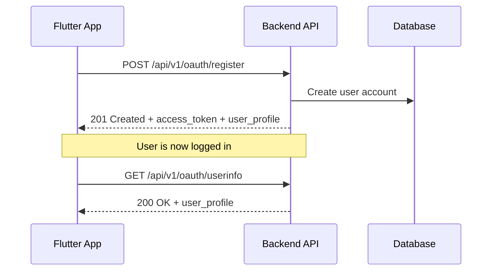
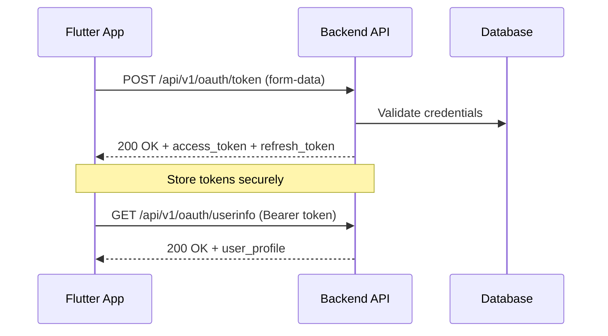
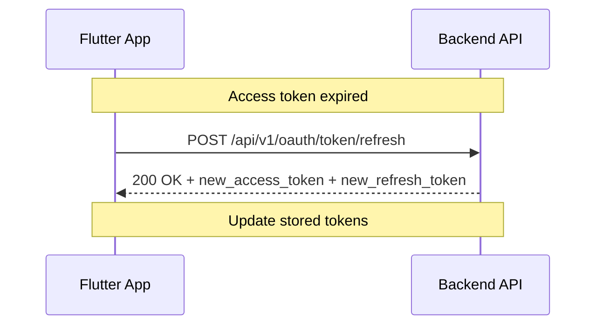
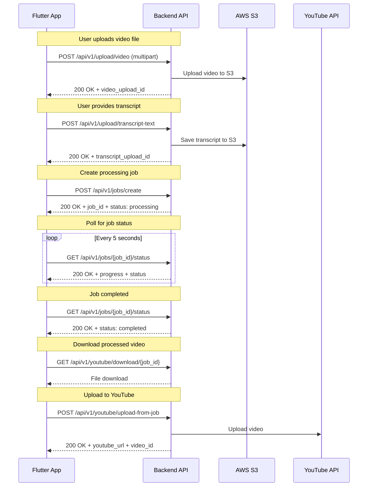

# Flutter Integration Workflow Guide

## Complete User Journey Workflow

This document outlines the complete workflow for integrating your Flutter app with the YouTube Shorts Creator API, showing the exact sequence of API calls needed for each user journey.

## 1. User Authentication Flow

### Registration and Login Sequence



### Login Sequence



### Token Refresh Sequence



## 2. Video Creation Workflow

### Complete Video Processing Sequence



## 3. Flutter Implementation Guide

### 1. Project Setup

Add these dependencies to your `pubspec.yaml`:

```yaml
dependencies:
  flutter:
    sdk: flutter
  http: ^1.1.0
  shared_preferences: ^2.2.2
  file_picker: ^6.1.1
  video_player: ^2.8.1
  provider: ^6.1.1
  json_annotation: ^4.8.1

dev_dependencies:
  build_runner: ^2.4.7
  json_serializable: ^6.7.1
```

### 2. API Service Structure

```dart
// lib/services/api_service.dart
class ApiService {
  static const String baseUrl = 'http://localhost:8000'; // Change for production
  static const String apiVersion = 'v1';
  
  static String get apiBaseUrl => '$baseUrl/api/$apiVersion';
  
  // HTTP client with error handling
  static Future<http.Response> _makeRequest(
    String method,
    String endpoint, {
    Map<String, String>? headers,
    dynamic body,
    String? token,
  }) async {
    final uri = Uri.parse('$apiBaseUrl$endpoint');
    final defaultHeaders = <String, String>{
      'Content-Type': 'application/json',
      if (token != null) 'Authorization': 'Bearer $token',
    };
    
    final mergedHeaders = {...defaultHeaders, ...?headers};
    
    http.Response response;
    
    switch (method.toUpperCase()) {
      case 'GET':
        response = await http.get(uri, headers: mergedHeaders);
        break;
      case 'POST':
        response = await http.post(uri, headers: mergedHeaders, body: body);
        break;
      case 'PUT':
        response = await http.put(uri, headers: mergedHeaders, body: body);
        break;
      case 'DELETE':
        response = await http.delete(uri, headers: mergedHeaders);
        break;
      default:
        throw Exception('Unsupported HTTP method: $method');
    }
    
    // Handle common errors
    if (response.statusCode >= 400) {
      final errorData = json.decode(response.body);
      throw ApiException(
        statusCode: response.statusCode,
        message: errorData['detail'] ?? 'Unknown error',
      );
    }
    
    return response;
  }
}

class ApiException implements Exception {
  final int statusCode;
  final String message;
  
  ApiException({required this.statusCode, required this.message});
  
  @override
  String toString() => 'ApiException($statusCode): $message';
}
```

### 3. Authentication Service

```dart
// lib/services/auth_service.dart
class AuthService {
  static const String _tokenKey = 'access_token';
  static const String _refreshTokenKey = 'refresh_token';
  static const String _userKey = 'user_data';
  
  // Login with email and password
  static Future<AuthResponse> login(String email, String password) async {
    final response = await http.post(
      Uri.parse('${ApiService.apiBaseUrl}/oauth/token'),
      headers: {'Content-Type': 'application/x-www-form-urlencoded'},
      body: {
        'grant_type': 'password',
        'username': email,
        'password': password,
        'scope': 'read write upload youtube',
      },
    );
    
    if (response.statusCode == 200) {
      final authResponse = AuthResponse.fromJson(json.decode(response.body));
      
      // Store tokens securely
      await _storeTokens(authResponse.accessToken, authResponse.refreshToken);
      
      // Get and store user profile
      final userProfile = await getUserProfile(authResponse.accessToken);
      await _storeUserData(userProfile);
      
      return authResponse;
    } else {
      throw ApiException(
        statusCode: response.statusCode,
        message: 'Login failed: ${response.body}',
      );
    }
  }
  
  // Register new user
  static Future<AuthResponse> register(UserRegisterRequest request) async {
    final response = await ApiService._makeRequest(
      'POST',
      '/oauth/register',
      body: json.encode(request.toJson()),
    );
    
    final authResponse = AuthResponse.fromJson(json.decode(response.body));
    
    // Store tokens and user data
    await _storeTokens(authResponse.accessToken, authResponse.refreshToken);
    if (authResponse.user != null) {
      await _storeUserData(authResponse.user!);
    }
    
    return authResponse;
  }
  
  // Get user profile
  static Future<UserProfile> getUserProfile(String token) async {
    final response = await ApiService._makeRequest(
      'GET',
      '/oauth/userinfo',
      token: token,
    );
    
    return UserProfile.fromJson(json.decode(response.body));
  }
  
  // Refresh access token
  static Future<AuthResponse> refreshToken() async {
    final refreshToken = await _getStoredRefreshToken();
    if (refreshToken == null) {
      throw Exception('No refresh token available');
    }
    
    final response = await ApiService._makeRequest(
      'POST',
      '/oauth/token/refresh',
      body: json.encode({'refresh_token': refreshToken}),
    );
    
    final authResponse = AuthResponse.fromJson(json.decode(response.body));
    await _storeTokens(authResponse.accessToken, authResponse.refreshToken);
    
    return authResponse;
  }
  
  // Check if user is logged in
  static Future<bool> isLoggedIn() async {
    final token = await _getStoredToken();
    return token != null && !_isTokenExpired(token);
  }
  
  // Get stored access token
  static Future<String?> getStoredToken() async {
    return await _getStoredToken();
  }
  
  // Logout
  static Future<void> logout() async {
    final prefs = await SharedPreferences.getInstance();
    await prefs.remove(_tokenKey);
    await prefs.remove(_refreshTokenKey);
    await prefs.remove(_userKey);
  }
  
  // Private helper methods
  static Future<void> _storeTokens(String accessToken, String? refreshToken) async {
    final prefs = await SharedPreferences.getInstance();
    await prefs.setString(_tokenKey, accessToken);
    if (refreshToken != null) {
      await prefs.setString(_refreshTokenKey, refreshToken);
    }
  }
  
  static Future<String?> _getStoredToken() async {
    final prefs = await SharedPreferences.getInstance();
    return prefs.getString(_tokenKey);
  }
  
  static Future<String?> _getStoredRefreshToken() async {
    final prefs = await SharedPreferences.getInstance();
    return prefs.getString(_refreshTokenKey);
  }
  
  static Future<void> _storeUserData(UserProfile user) async {
    final prefs = await SharedPreferences.getInstance();
    await prefs.setString(_userKey, json.encode(user.toJson()));
  }
  
  static bool _isTokenExpired(String token) {
    try {
      final parts = token.split('.');
      final payload = json.decode(
        utf8.decode(base64Url.decode(base64Url.normalize(parts[1]))),
      );
      final exp = payload['exp'] as int;
      return DateTime.now().millisecondsSinceEpoch / 1000 >= exp;
    } catch (e) {
      return true; // Assume expired if we can't parse
    }
  }
}
```

### 4. Upload Service

```dart
// lib/services/upload_service.dart
class UploadService {
  // Upload video file
  static Future<UploadResponse> uploadVideo(File videoFile) async {
    final token = await AuthService.getStoredToken();
    if (token == null) throw Exception('Not authenticated');
    
    var request = http.MultipartRequest(
      'POST',
      Uri.parse('${ApiService.apiBaseUrl}/upload/video'),
    );
    
    request.headers['Authorization'] = 'Bearer $token';
    request.files.add(await http.MultipartFile.fromPath('file', videoFile.path));
    request.fields['is_temp'] = 'true';
    
    var streamedResponse = await request.send();
    var response = await http.Response.fromStream(streamedResponse);
    
    if (response.statusCode == 200) {
      return UploadResponse.fromJson(json.decode(response.body));
    } else {
      throw ApiException(
        statusCode: response.statusCode,
        message: 'Upload failed: ${response.body}',
      );
    }
  }
  
  // Upload transcript text
  static Future<UploadResponse> uploadTranscript(String content) async {
    final token = await AuthService.getStoredToken();
    if (token == null) throw Exception('Not authenticated');
    
    final response = await ApiService._makeRequest(
      'POST',
      '/upload/transcript-text',
      token: token,
      body: json.encode({'content': content}),
    );
    
    return UploadResponse.fromJson(json.decode(response.body));
  }
  
  // Upload transcript file
  static Future<UploadResponse> uploadTranscriptFile(File transcriptFile) async {
    final token = await AuthService.getStoredToken();
    if (token == null) throw Exception('Not authenticated');
    
    var request = http.MultipartRequest(
      'POST',
      Uri.parse('${ApiService.apiBaseUrl}/upload/transcript-file'),
    );
    
    request.headers['Authorization'] = 'Bearer $token';
    request.files.add(await http.MultipartFile.fromPath('file', transcriptFile.path));
    request.fields['is_temp'] = 'true';
    
    var streamedResponse = await request.send();
    var response = await http.Response.fromStream(streamedResponse);
    
    if (response.statusCode == 200) {
      return UploadResponse.fromJson(json.decode(response.body));
    } else {
      throw ApiException(
        statusCode: response.statusCode,
        message: 'Upload failed: ${response.body}',
      );
    }
  }
  
  // Get upload details
  static Future<UploadResponse> getUpload(String uploadId) async {
    final token = await AuthService.getStoredToken();
    if (token == null) throw Exception('Not authenticated');
    
    final response = await ApiService._makeRequest(
      'GET',
      '/upload/$uploadId',
      token: token,
    );
    
    return UploadResponse.fromJson(json.decode(response.body));
  }
  
  // Delete upload
  static Future<void> deleteUpload(String uploadId) async {
    final token = await AuthService.getStoredToken();
    if (token == null) throw Exception('Not authenticated');
    
    await ApiService._makeRequest(
      'DELETE',
      '/upload/$uploadId',
      token: token,
    );
  }
}
```

### 5. Job Management Service

```dart
// lib/services/job_service.dart
class JobService {
  // Create processing job
  static Future<JobResponse> createJob(JobCreateRequest request) async {
    final token = await AuthService.getStoredToken();
    if (token == null) throw Exception('Not authenticated');
    
    final response = await ApiService._makeRequest(
      'POST',
      '/jobs/create',
      token: token,
      body: json.encode(request.toJson()),
    );
    
    return JobResponse.fromJson(json.decode(response.body));
  }
  
  // Get job details
  static Future<JobResponse> getJob(String jobId) async {
    final token = await AuthService.getStoredToken();
    if (token == null) throw Exception('Not authenticated');
    
    final response = await ApiService._makeRequest(
      'GET',
      '/jobs/$jobId',
      token: token,
    );
    
    return JobResponse.fromJson(json.decode(response.body));
  }
  
  // Get job status with progress
  static Future<JobStatus> getJobStatus(String jobId) async {
    final token = await AuthService.getStoredToken();
    if (token == null) throw Exception('Not authenticated');
    
    final response = await ApiService._makeRequest(
      'GET',
      '/jobs/$jobId/status',
      token: token,
    );
    
    return JobStatus.fromJson(json.decode(response.body));
  }
  
  // List jobs with pagination
  static Future<JobList> listJobs({
    int page = 1,
    int perPage = 20,
    String? statusFilter,
  }) async {
    final token = await AuthService.getStoredToken();
    if (token == null) throw Exception('Not authenticated');
    
    var queryParams = <String, String>{
      'page': page.toString(),
      'per_page': perPage.toString(),
    };
    
    if (statusFilter != null) {
      queryParams['status_filter'] = statusFilter;
    }
    
    final queryString = Uri(queryParameters: queryParams).query;
    final endpoint = '/jobs?$queryString';
    
    final response = await ApiService._makeRequest(
      'GET',
      endpoint,
      token: token,
    );
    
    return JobList.fromJson(json.decode(response.body));
  }
  
  // Delete job
  static Future<void> deleteJob(String jobId) async {
    final token = await AuthService.getStoredToken();
    if (token == null) throw Exception('Not authenticated');
    
    await ApiService._makeRequest(
      'DELETE',
      '/jobs/$jobId',
      token: token,
    );
  }
  
  // Poll job status until completion
  static Stream<JobStatus> pollJobStatus(String jobId) async* {
    while (true) {
      try {
        final status = await getJobStatus(jobId);
        yield status;
        
        if (status.status == 'completed' || status.status == 'failed') {
          break;
        }
        
        await Future.delayed(const Duration(seconds: 5));
      } catch (e) {
        yield JobStatus(
          id: jobId,
          status: 'error',
          progress: 0,
          currentStep: 'error',
          errorMessage: e.toString(),
          createdAt: DateTime.now(),
          updatedAt: DateTime.now(),
          tempFilesCleaned: false,
          permanentStorage: false,
        );
        break;
      }
    }
  }
}
```

### 6. YouTube Service

```dart
// lib/services/youtube_service.dart
class YouTubeService {
  // Get supported voices
  static Future<SupportedVoices> getSupportedVoices() async {
    final response = await ApiService._makeRequest('GET', '/youtube/voices');
    return SupportedVoices.fromJson(json.decode(response.body));
  }
  
  // Get YouTube service info
  static Future<Map<String, dynamic>> getServiceInfo() async {
    final response = await ApiService._makeRequest('GET', '/youtube/info');
    return json.decode(response.body);
  }
  
  // Download processed video
  static Future<void> downloadProcessedVideo(String jobId, String savePath) async {
    final token = await AuthService.getStoredToken();
    if (token == null) throw Exception('Not authenticated');
    
    final response = await http.get(
      Uri.parse('${ApiService.apiBaseUrl}/youtube/download/$jobId'),
      headers: {'Authorization': 'Bearer $token'},
    );
    
    if (response.statusCode == 200) {
      final file = File(savePath);
      await file.writeAsBytes(response.bodyBytes);
    } else {
      throw ApiException(
        statusCode: response.statusCode,
        message: 'Download failed: ${response.body}',
      );
    }
  }
  
  // Upload video to YouTube directly
  static Future<Map<String, dynamic>> uploadVideoToYouTube(
    File videoFile,
    String title,
    String description, {
    List<String>? tags,
    String category = 'entertainment',
    String privacy = 'public',
  }) async {
    final token = await AuthService.getStoredToken();
    if (token == null) throw Exception('Not authenticated');
    
    var request = http.MultipartRequest(
      'POST',
      Uri.parse('${ApiService.apiBaseUrl}/youtube/upload-direct'),
    );
    
    request.headers['Authorization'] = 'Bearer $token';
    request.files.add(await http.MultipartFile.fromPath('file', videoFile.path));
    request.fields['title'] = title;
    request.fields['description'] = description;
    request.fields['tags'] = tags?.join(',') ?? '';
    request.fields['category'] = category;
    request.fields['privacy'] = privacy;
    
    var streamedResponse = await request.send();
    var response = await http.Response.fromStream(streamedResponse);
    
    if (response.statusCode == 200) {
      return json.decode(response.body);
    } else {
      throw ApiException(
        statusCode: response.statusCode,
        message: 'YouTube upload failed: ${response.body}',
      );
    }
  }
  
  // Upload processed video to YouTube
  static Future<Map<String, dynamic>> uploadProcessedVideoToYouTube(
    String jobId,
    String title,
    String description, {
    List<String>? tags,
    String category = 'entertainment',
    String privacy = 'public',
  }) async {
    final token = await AuthService.getStoredToken();
    if (token == null) throw Exception('Not authenticated');
    
    final response = await http.post(
      Uri.parse('${ApiService.apiBaseUrl}/youtube/upload-from-job'),
      headers: {
        'Content-Type': 'application/x-www-form-urlencoded',
        'Authorization': 'Bearer $token',
      },
      body: {
        'job_id': jobId,
        'title': title,
        'description': description,
        'tags': tags?.join(',') ?? '',
        'category': category,
        'privacy': privacy,
      },
    );
    
    if (response.statusCode == 200) {
      return json.decode(response.body);
    } else {
      throw ApiException(
        statusCode: response.statusCode,
        message: 'YouTube upload failed: ${response.body}',
      );
    }
  }
}
```

## 4. Complete UI Example

### Main App Flow

```dart
// lib/screens/video_creation_screen.dart
class VideoCreationScreen extends StatefulWidget {
  @override
  _VideoCreationScreenState createState() => _VideoCreationScreenState();
}

class _VideoCreationScreenState extends State<VideoCreationScreen> {
  File? _selectedVideo;
  String _transcript = '';
  String _title = '';
  String _description = '';
  String _selectedVoice = 'alloy';
  List<String> _tags = [];
  
  bool _isUploading = false;
  bool _isProcessing = false;
  double _uploadProgress = 0.0;
  String? _currentJobId;
  JobStatus? _jobStatus;
  
  @override
  Widget build(BuildContext context) {
    return Scaffold(
      appBar: AppBar(title: Text('Create YouTube Short')),
      body: Padding(
        padding: EdgeInsets.all(16),
        child: Column(
          children: [
            // Video selection
            _buildVideoSelector(),
            SizedBox(height: 16),
            
            // Transcript input
            _buildTranscriptInput(),
            SizedBox(height: 16),
            
            // Video details
            _buildVideoDetails(),
            SizedBox(height: 16),
            
            // Voice selection
            _buildVoiceSelector(),
            SizedBox(height: 24),
            
            // Create button
            _buildCreateButton(),
            
            // Progress indicators
            if (_isUploading || _isProcessing) _buildProgressIndicator(),
          ],
        ),
      ),
    );
  }
  
  Widget _buildVideoSelector() {
    return Card(
      child: ListTile(
        title: Text(_selectedVideo == null ? 'Select Video' : 'Video Selected'),
        subtitle: Text(_selectedVideo?.path ?? 'No video selected'),
        leading: Icon(Icons.video_library),
        onTap: _selectVideo,
      ),
    );
  }
  
  Widget _buildTranscriptInput() {
    return TextField(
      decoration: InputDecoration(
        labelText: 'Transcript',
        hintText: 'Enter the text for voiceover...',
        border: OutlineInputBorder(),
      ),
      maxLines: 4,
      onChanged: (value) => _transcript = value,
    );
  }
  
  Widget _buildVideoDetails() {
    return Column(
      children: [
        TextField(
          decoration: InputDecoration(
            labelText: 'Title',
            border: OutlineInputBorder(),
          ),
          onChanged: (value) => _title = value,
        ),
        SizedBox(height: 8),
        TextField(
          decoration: InputDecoration(
            labelText: 'Description',
            border: OutlineInputBorder(),
          ),
          maxLines: 2,
          onChanged: (value) => _description = value,
        ),
      ],
    );
  }
  
  Widget _buildVoiceSelector() {
    return FutureBuilder<SupportedVoices>(
      future: YouTubeService.getSupportedVoices(),
      builder: (context, snapshot) {
        if (!snapshot.hasData) return CircularProgressIndicator();
        
        return DropdownButtonFormField<String>(
          value: _selectedVoice,
          decoration: InputDecoration(
            labelText: 'Voice',
            border: OutlineInputBorder(),
          ),
          items: snapshot.data!.voices.map((voice) {
            return DropdownMenuItem(value: voice, child: Text(voice));
          }).toList(),
          onChanged: (value) => setState(() => _selectedVoice = value!),
        );
      },
    );
  }
  
  Widget _buildCreateButton() {
    return ElevatedButton(
      onPressed: (_selectedVideo != null && _transcript.isNotEmpty && _title.isNotEmpty) 
          ? _createVideo : null,
      child: Text('Create YouTube Short'),
    );
  }
  
  Widget _buildProgressIndicator() {
    return Card(
      child: Padding(
        padding: EdgeInsets.all(16),
        child: Column(
          children: [
            if (_isUploading) ...[
              Text('Uploading files...'),
              LinearProgressIndicator(value: _uploadProgress),
            ],
            if (_isProcessing && _jobStatus != null) ...[
              Text('Processing video...'),
              LinearProgressIndicator(value: _jobStatus!.progress / 100),
              Text(_jobStatus!.progressMessage ?? ''),
            ],
          ],
        ),
      ),
    );
  }
  
  Future<void> _selectVideo() async {
    final result = await FilePicker.platform.pickFiles(
      type: FileType.video,
      allowedExtensions: ['mp4', 'mov', 'avi', 'mkv'],
    );
    
    if (result != null) {
      setState(() {
        _selectedVideo = File(result.files.single.path!);
      });
    }
  }
  
  Future<void> _createVideo() async {
    setState(() => _isUploading = true);
    
    try {
      // 1. Upload video
      final videoUpload = await UploadService.uploadVideo(_selectedVideo!);
      
      // 2. Upload transcript
      final transcriptUpload = await UploadService.uploadTranscript(_transcript);
      
      setState(() {
        _isUploading = false;
        _isProcessing = true;
      });
      
      // 3. Create job
      final jobRequest = JobCreateRequest(
        title: _title,
        description: _description,
        voice: _selectedVoice,
        tags: _tags,
        videoUploadId: videoUpload.id,
        transcriptUploadId: transcriptUpload.id,
      );
      
      final job = await JobService.createJob(jobRequest);
      _currentJobId = job.id;
      
      // 4. Poll job status
      JobService.pollJobStatus(job.id).listen((status) {
        setState(() => _jobStatus = status);
        
        if (status.status == 'completed') {
          setState(() => _isProcessing = false);
          _showCompletionDialog();
        } else if (status.status == 'failed') {
          setState(() => _isProcessing = false);
          _showErrorDialog(status.errorMessage ?? 'Processing failed');
        }
      });
      
    } catch (e) {
      setState(() {
        _isUploading = false;
        _isProcessing = false;
      });
      _showErrorDialog(e.toString());
    }
  }
  
  void _showCompletionDialog() {
    showDialog(
      context: context,
      builder: (context) => AlertDialog(
        title: Text('Video Ready!'),
        content: Text('Your YouTube Short has been processed successfully.'),
        actions: [
          TextButton(
            onPressed: () => Navigator.pop(context),
            child: Text('Download'),
          ),
          TextButton(
            onPressed: () => _uploadToYouTube(),
            child: Text('Upload to YouTube'),
          ),
        ],
      ),
    );
  }
  
  void _showErrorDialog(String message) {
    showDialog(
      context: context,
      builder: (context) => AlertDialog(
        title: Text('Error'),
        content: Text(message),
        actions: [
          TextButton(
            onPressed: () => Navigator.pop(context),
            child: Text('OK'),
          ),
        ],
      ),
    );
  }
  
  Future<void> _uploadToYouTube() async {
    try {
      final result = await YouTubeService.uploadProcessedVideoToYouTube(
        _currentJobId!,
        _title,
        _description,
        tags: _tags,
      );
      
      // Show success with YouTube URL
      showDialog(
        context: context,
        builder: (context) => AlertDialog(
          title: Text('Uploaded to YouTube!'),
          content: Text('Video URL: ${result['video_url']}'),
          actions: [
            TextButton(
              onPressed: () => Navigator.pop(context),
              child: Text('OK'),
            ),
          ],
        ),
      );
    } catch (e) {
      _showErrorDialog('YouTube upload failed: $e');
    }
  }
}
```

## 5. Error Handling Strategy

```dart
// lib/utils/error_handler.dart
class ErrorHandler {
  static void handleApiError(BuildContext context, dynamic error) {
    String message = 'An unexpected error occurred';
    
    if (error is ApiException) {
      switch (error.statusCode) {
        case 401:
          message = 'Please log in again';
          _redirectToLogin(context);
          break;
        case 403:
          message = 'You don\'t have permission for this action';
          break;
        case 413:
          message = 'File too large. Maximum size is 100MB';
          break;
        case 422:
          message = 'Invalid input data';
          break;
        case 500:
          message = 'Server error. Please try again later';
          break;
        default:
          message = error.message;
      }
    }
    
    ScaffoldMessenger.of(context).showSnackBar(
      SnackBar(content: Text(message)),
    );
  }
  
  static void _redirectToLogin(BuildContext context) {
    Navigator.pushNamedAndRemoveUntil(
      context,
      '/login',
      (route) => false,
    );
  }
}
```

## 6. Testing Strategy

### Unit Tests

```dart
// test/services/auth_service_test.dart
import 'package:flutter_test/flutter_test.dart';
import 'package:mockito/mockito.dart';

void main() {
  group('AuthService', () {
    test('login returns AuthResponse on success', () async {
      // Mock HTTP response
      // Test login flow
    });
    
    test('login throws ApiException on failure', () async {
      // Test error handling
    });
    
    test('refreshToken updates stored tokens', () async {
      // Test token refresh
    });
  });
}
```

### Integration Tests

```dart
// integration_test/app_test.dart
import 'package:flutter/material.dart';
import 'package:flutter_test/flutter_test.dart';
import 'package:integration_test/integration_test.dart';

void main() {
  IntegrationTestWidgetsFlutterBinding.ensureInitialized();
  
  group('End-to-End Tests', () {
    testWidgets('Complete video creation flow', (tester) async {
      // Test the entire workflow from login to video creation
    });
  });
}
```

This comprehensive workflow guide provides everything your Flutter team needs to successfully integrate with your YouTube Shorts Creator API. The examples show real-world implementation patterns and handle all the edge cases they'll encounter during development. 